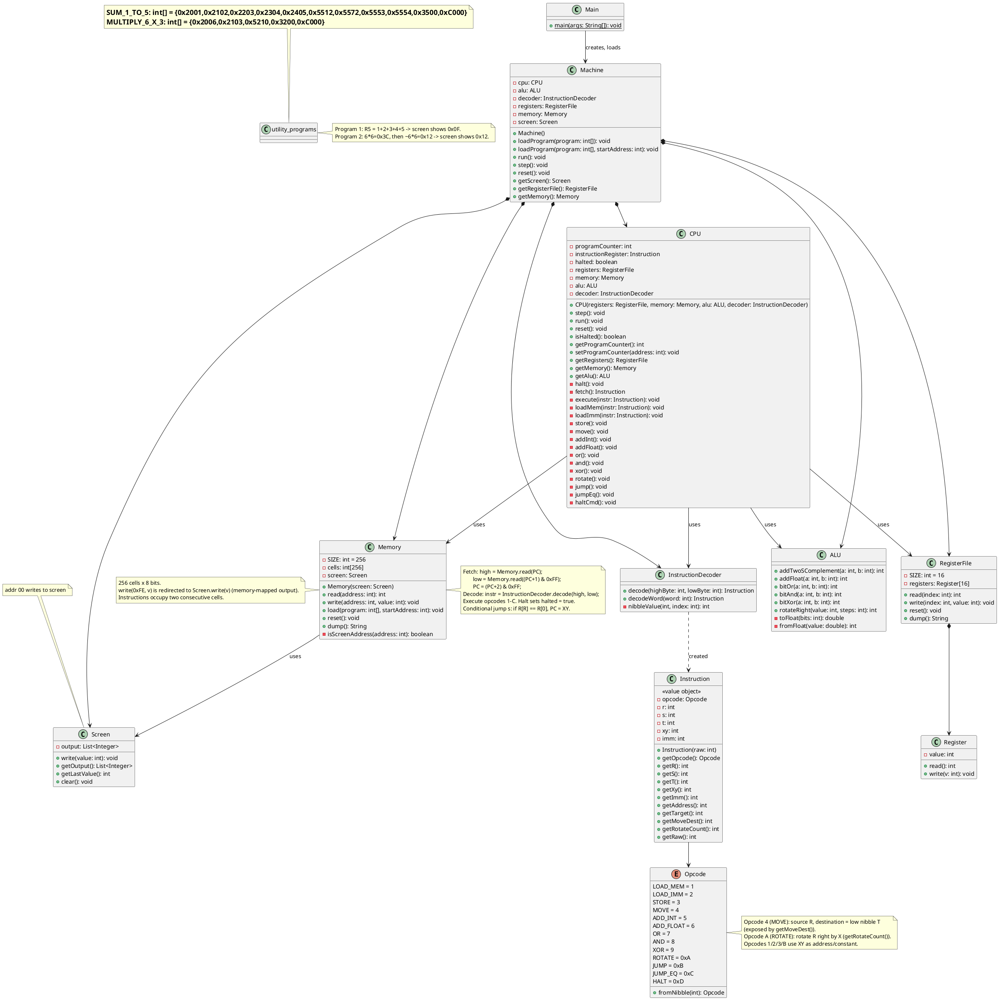

```plantuml
@startuml
class Main {
  +{static} main(args: String[]): void
}

class Machine {
  -cpu: CPU
  -alu: ALU
  -decoder: InstructionDecoder
  -registers: RegisterFile
  -memory: Memory
  -screen: Screen
  +Machine()
  +loadProgram(program: int[]): void
  +loadProgram(program: int[], startAddress: int): void
  +run(): void
  +step(): void
  +reset(): void
  +getScreen(): Screen
  +getRegisterFile(): RegisterFile
  +getMemory(): Memory
}

class CPU {
  -programCounter: int
  -instructionRegister: Instruction
  -halted: boolean
  -registers: RegisterFile
  -memory: Memory
  -alu: ALU
  -decoder: InstructionDecoder
  +CPU(registers: RegisterFile, memory: Memory, alu: ALU, decoder: InstructionDecoder)
  +step(): void
  +run(): void
  +reset(): void
  +isHalted(): boolean
  +getProgramCounter(): int
  +setProgramCounter(address: int): void
  +getRegisters(): RegisterFile
  +getMemory(): Memory
  +getAlu(): ALU
  -halt(): void
  -fetch(): Instruction
  -execute(instr: Instruction): void
  -loadMem(instr: Instruction): void
  -loadImm(instr: Instruction): void
  -store(): void
  -move(): void
  -addInt(): void
  -addFloat(): void
  -or(): void
  -and(): void
  -xor(): void
  -rotate(): void
  -jump(): void
  -jumpEq(): void
  -haltCmd(): void
}

class Memory {
  -SIZE: int = 256
  -cells: int[256]
  -screen: Screen
  +Memory(screen: Screen)
  +read(address: int): int
  +write(address: int, value: int): void
  +load(program: int[], startAddress: int): void
  +reset(): void
  +dump(): String
  -isScreenAddress(address: int): boolean
}

class InstructionDecoder {
  +decode(highByte: int, lowByte: int): Instruction
  +decodeWord(word: int): Instruction
  -nibbleValue(int, index: int): int
}

class Instruction {
  <<value object>>
  -opcode: Opcode
  -r: int
  -s: int
  -t: int
  -xy: int
  -imm: int
  +Instruction(raw: int)
  +getOpcode(): Opcode
  +getR(): int
  +getS(): int
  +getT(): int
  +getXy(): int
  +getImm(): int
  +getAddress(): int
  +getTarget(): int
  +getMoveDest(): int
  +getRotateCount(): int
  +getRaw(): int
}

enum Opcode {
  LOAD_MEM = 1
  LOAD_IMM = 2
  STORE = 3
  MOVE = 4
  ADD_INT = 5
  ADD_FLOAT = 6
  OR = 7
  AND = 8
  XOR = 9
  ROTATE = 0xA
  JUMP = 0xB
  JUMP_EQ = 0xC
  HALT = 0xD
  +fromNibble(int): Opcode
}

class ALU {
  +addTwoSComplement(a: int, b: int): int
  +addFloat(a: int, b: int): int
  +bitOr(a: int, b: int): int
  +bitAnd(a: int, b: int): int
  +bitXor(a: int, b: int): int
  +rotateRight(value: int, steps: int): int
  -toFloat(bits: int): double
  -fromFloat(value: double): int
}

class RegisterFile {
  -SIZE: int = 16
  -registers: Register[16]
  +read(index: int): int
  +write(index: int, value: int): void
  +reset(): void
  +dump(): String
}

class Register {
  -value: int
  +read(): int
  +write(v: int): void
}

class Screen {
  -output: List<Integer>
  +write(value: int): void
  +getOutput(): List<Integer>
  +getLastValue(): int
  +clear(): void
}

class utility_programs {
}

Main --> Machine : creates, loads
Machine *--> CPU
Machine *--> ALU
Machine *--> InstructionDecoder
Machine *--> RegisterFile
Machine *--> Memory
Machine *--> Screen
CPU --> RegisterFile : uses
CPU --> Memory : uses
CPU --> ALU : uses
CPU --> InstructionDecoder : uses
Memory --> Screen : uses
InstructionDecoder ..> Instruction : created
Instruction --> Opcode
RegisterFile *--> Register

note top of utility_programs
  =SUM_1_TO_5: int[] = {0x2001,0x2102,0x2203,0x2304,0x2405,0x5512,0x5572,0x5553,0x5554,0x3500,0xC000}
  =MULTIPLY_6_X_3: int[] = {0x2006,0x2103,0x5210,0x3200,0xC000}
end note

note right of utility_programs
  Program 1: R5 = 1+2+3+4+5 -> screen shows 0x0F.
  Program 2: 6*6=0x3C, then ~6*6=0x12 -> screen shows 0x12.
end note

note left of Memory
  256 cells x 8 bits.
  write(0xFE, v) is redirected to Screen.write(v) (memory-mapped output).
  Instructions occupy two consecutive cells.
end note

note right of Memory
  Fetch: high = Memory.read(PC);
         low = Memory.read((PC+1) & 0xFF);
         PC = (PC+2) & 0xFF;
  Decode: instr = InstructionDecoder.decode(high, low);
  Execute opcodes 1-C. Halt sets halted = true.
  Conditional jump s: if R[R] == R[0], PC = XY.
end note

note top of Screen
  addr 00 writes to screen
end note

note right of Opcode
  Opcode 4 (MOVE): source R, destination = low nibble T
  (exposed by getMoveDest()).
  Opcode A (ROTATE): rotate R right by X (getRotateCount()).
  Opcodes 1/2/3/B use XY as address/constant.
end note

@endum
```
